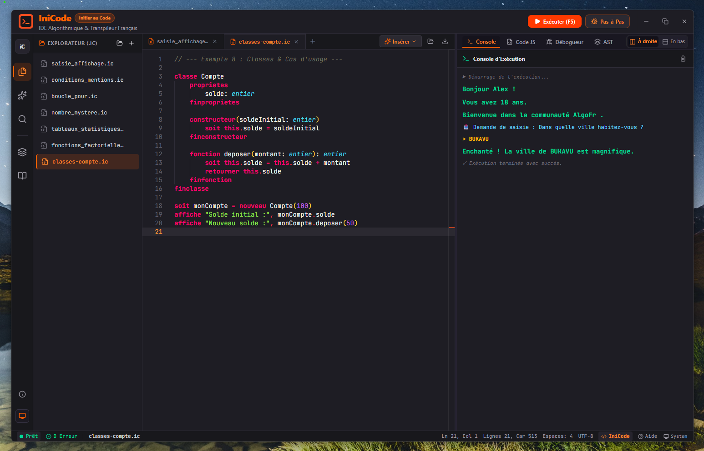

# IniCode

IDE d’apprentissage de l’algorithmique et de la programmation, pensée pour apprendre en français avec une syntaxe proche du pseudo-code.

## Version en ligne

https://inicode.freedev-academy.com

**directement vers l'IDE**

https://inicode.freedev-academy.com/#/ide

## Aperçu

IniCode est un environnement de développement éducatif qui permet de :

- écrire des algorithmes en français
- visualiser immédiatement la sortie exécutable
- comprendre la transpilation vers JavaScript/TypeScript
- explorer les structures de contrôle, les fonctions, les tableaux et les classes
- apprendre avec une interface de type IDE moderne et pédagogique

## Capture d’écran



## Fonctionnalités

- Éditeur de code avec coloration syntaxique et complétion
- Exécution interactive des programmes
- Console de sortie avec résultats et messages système
- Support de la syntaxe française : `soit`, `afficher`, `si`, `sinon`, `pour`, `tant que`, etc.
- Documentation intégrée et exemples pratiques
- Transpileur personnalisé vers JavaScript/TypeScript
- Support des classes et des objets pour un apprentissage plus complet

## Prérequis

- Node.js 18+
- npm

## Démarrage rapide

1. Installer les dépendances :

   ```bash
   npm install
   ```

2. Lancer l’application en mode développement :

   ```bash
   npm run dev
   ```

3. Ouvrir l’URL affichée dans le terminal, généralement :
   ```bash
   http://localhost:3000
   ```

## Scripts disponibles

```bash
npm run dev
npm run build
npm run preview
npm run lint
```

## Structure du projet

- `src/` : interface, éditeur, docs, transpileur et logique applicative
- `docs/` : documentation pédagogique
- `examples/` : exemples d’algorithmes et cas d’usage
- `public/` : ressources statiques
- `screenshot.png` : capture de l’application

## Licence

Projet éducatif interne / de démonstration.
